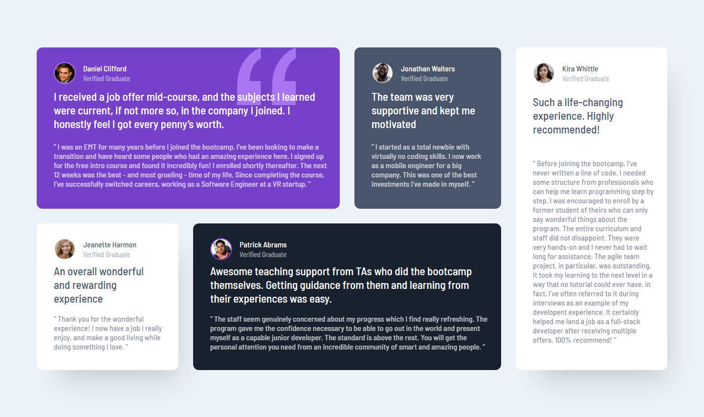
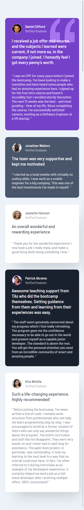

## Getting Started

First, run the development server:

```bash
yarn install
# or
yarn dev
```

Open [http://localhost:3000](http://localhost:3000) with your browser to see the result.

## Desktop Screenshot



## Mobile Screenshot


